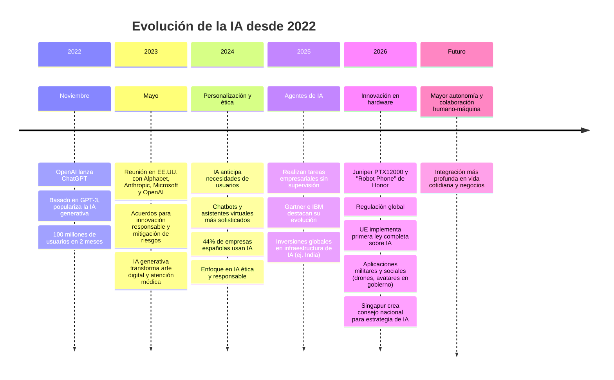

```mermaid
timeline
  title Evolución de la IA desde 2022
  section 2022
    Noviembre : OpenAI lanza ChatGPT
    : Basado en GPT-3, populariza la IA generativa
    : 100 millones de usuarios en 2 meses

  section 2023
    Mayo : Reunión en EE.UU. con Alphabet, Anthropic, Microsoft y OpenAI
    : Acuerdos para innovación responsable y mitigación de riesgos
    : IA generativa transforma arte digital y atención médica

  section 2024
    Personalización y ética : IA anticipa necesidades de usuarios
    : Chatbots y asistentes virtuales más sofisticados
    : 44% de empresas españolas usan IA
    : Enfoque en IA ética y responsable

  section 2025
    Agentes de IA : Realizan tareas empresariales sin supervisión
    : Gartner e IBM destacan su evolución
    : Inversiones globales en infraestructura de IA (ej. India)

  section 2026
    Innovación en hardware : Juniper PTX12000 y "Robot Phone" de Honor
    : Regulación global: UE implementa primera ley completa sobre IA
    : Aplicaciones militares y sociales (drones, avatares en gobierno)
    : Singapur crea consejo nacional para estrategia de IA

  section Futuro
    Mayor autonomía y colaboración humano-máquina
    : Integración más profunda en vida cotidiana y negocios


```
