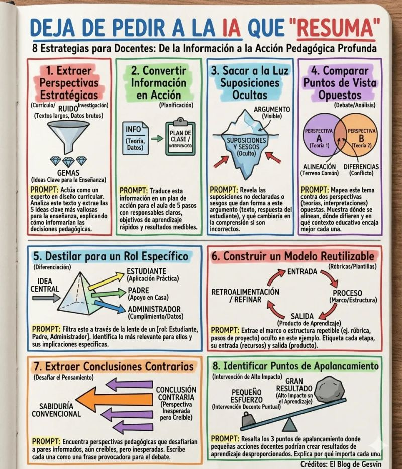

### Listado de Prompts para Acción Pedagógica con IA

Este listado recopila estrategias y prompts diseñados para docentes que buscan ir más allá del resumen de información con la Inteligencia Artificial, fomentando un análisis y una acción pedagógica más profunda.

---

#### 1. Extraer Perspectivas Estratégicas

Utiliza este prompt para filtrar textos extensos y datos brutos (como currículos o investigaciones) e identificar las ideas clave ("gemas") para la enseñanza.

```Actúa como un experto en diseño curricular. Analiza este texto y extrae las 5 ideas clave más valiosas para la enseñanza, explicando cómo informarían las decisiones pedagógicas.```

---

#### 2. Convertir Información en Acción

Este prompt te ayuda a transformar la teoría y los datos de un tema en un plan de acción concreto y estructurado para el aula.

```Traduce esta información en un plan de acción para el aula de 5 pasos con responsables claros, objetivos de aprendizaje rápidos y resultados medibles.```

---

#### 3. Sacar a la Luz Suposiciones Ocultas

Ideal para analizar un argumento (texto, respuesta de un estudiante) y revelar las suposiciones y sesgos subyacentes que no están declarados explícitamente.

```Revela las suposiciones no declaradas o sesgos que dan forma a este argumento (texto, respuesta del estudiante), y qué cambiaría en la comprensión si son incorrectos.```

---

#### 4. Comparar Puntos de Vista Opuestos

Usa este prompt para mapear un tema frente a dos perspectivas diferentes (teorías, interpretaciones), encontrando puntos comunes, diferencias y el mejor contexto educativo para cada una.

```Mapea este tema contra dos perspectivas (teorías, interpretaciones) opuestas. Muestra dónde se alinean, dónde difieren y en qué contexto educativo encaja mejor cada una.```

---

#### 5. Destilar para un Rol Específico

Filtra una idea central a través de la lente de un rol particular (Estudiante, Padre, Administrador) para identificar lo que es más relevante para ellos y sus implicaciones específicas.

```Filtra esto a través de la lente de un [rol: Estudiante, Padre, Administrador]. Identifica lo más relevante para ellos y sus implicaciones específicas.```

---

#### 6. Construir un Modelo Reutilizable

Este prompt te permite extraer el marco o la estructura repetible de un ejemplo dado (como una rúbrica o pasos de un proyecto), etiquetando cada etapa del proceso.

```Extrae el marco o estructura repetible (ej. rúbrica, pasos de proyecto) oculto en este ejemplo. Etiqueta cada etapa, su entrada (recursos) y salida (producto).```

---

#### 7. Extraer Conclusiones Contrarias

Diseñado para desafiar el pensamiento y la "sabiduría convencional", este prompt busca perspectivas pedagógicas inesperadas pero creíbles para generar debate.

```Encuentra perspectivas pedagógicas que desafiarían a pares informados, aún creíbles, pero inesperadas. Escribe cada una como una frase provocadora para el debate.```

---

#### 8. Identificar Puntos de Apalancamiento

Usa este prompt para identificar intervenciones de alto impacto donde un pequeño esfuerzo docente puede crear resultados de aprendizaje desproporcionados.

```Resalta los 3 puntos de apalancamiento donde pequeñas acciones docentes podrían crear resultados de aprendizaje desproporcionados. Explica por qué importa cada uno.```

