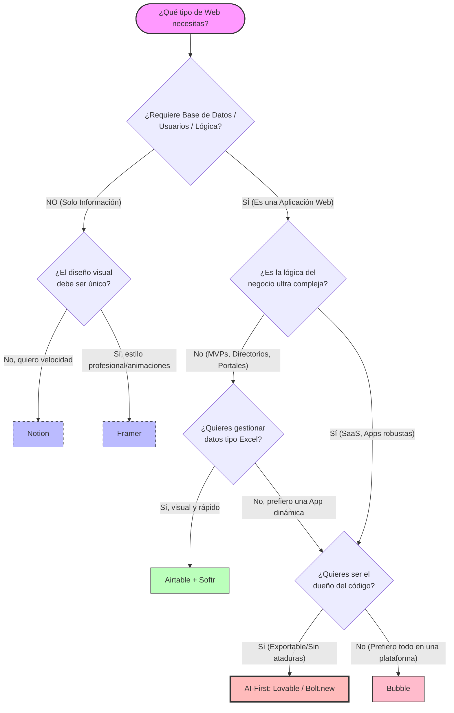

```mermaid
graph TD
    Start([¿Qué tipo de Web necesitas?]) --> Q1{¿Requiere Base de Datos /<br>Usuarios / Lógica?}
    
    %% CAMINO ESTÁTICO / DISEÑO
    Q1 -- NO (Solo Información) --> Q2{¿El diseño visual<br>debe ser único?}
    Q2 -- No, quiero velocidad --> R_Notion[Notion]
    Q2 -- Sí, estilo profesional/animaciones --> R_Framer[Framer]
    
    %% CAMINO BACKEND / DATOS
    Q1 -- SÍ (Es una Aplicación Web) --> Q3{¿Es la lógica del<br>negocio ultra compleja?}
    
    Q3 -- No (MVPs, Directorios, Portales) --> Q4{¿Quieres gestionar<br>datos tipo Excel?}
    Q4 -- Sí, visual y rápido --> R_Airtable[Airtable + Softr]
    Q4 -- No, prefiero una App dinámica --> Q5
    
    Q3 -- Sí (SaaS, Apps robustas) --> Q5{¿Quieres ser el<br>dueño del código?}
    
    Q5 -- Sí (Exportable/Sin ataduras) --> R_AI[AI-First: Lovable / Bolt.new]
    Q5 -- No (Prefiero todo en una plataforma) --> R_Bubble[Bubble]

    %% Estilos básicos
    style Start fill:#f9f,stroke:#333,stroke-width:2px
    style R_Notion fill:#bbf,stroke:#333,stroke-dasharray: 5 5
    style R_Framer fill:#bbf,stroke:#333,stroke-dasharray: 5 5
    style R_Airtable fill:#bfb,stroke:#333
    style R_AI fill:#fbb,stroke:#333,stroke-width:3px
    style R_Bubble fill:#fbc,stroke:#333
```