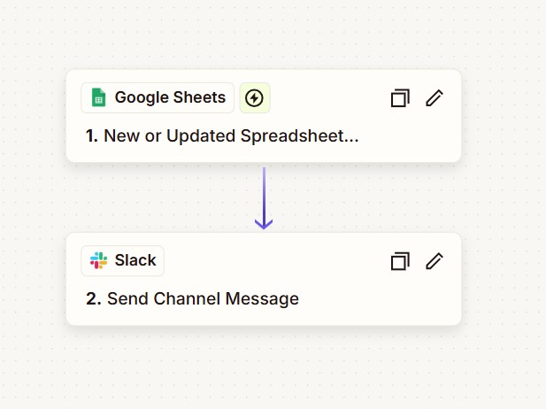

Para montar esta automatización de la manera más sencilla, directa y sin escribir ni una sola línea de código, la mejor ruta es usar **Zapier** o **Make** (anteriormente Integromat). Ambas herramientas actúan como un "puente" entre tus aplicaciones.

Aquí tienes el plan de acción simplificado usando **Zapier**, que es el más intuitivo para empezar:

---

## 🛠️ Los 3 Pasos de la Automatización

### 1. El Disparador (Trigger): Google Forms

Aunque los datos terminan en Google Sheets, es mucho más eficiente conectar el Zap directamente al formulario.

* **App:** Google Forms.
* **Evento:** "New Form Response".
* **Conexión:** Selecciona tu cuenta y el formulario específico.
* **Prueba:** Envía una respuesta real al formulario para que Zapier tenga datos con los que trabajar.

### 2. El Puente (Opcional): Google Sheets

Si el formulario ya envía los datos a una hoja de cálculo automáticamente (que es lo normal), Zapier los detectará desde el paso anterior. No necesitas añadir un paso extra para la hoja de cálculo a menos que necesites hacer cálculos complejos antes de enviar el mensaje.

### 3. La Acción (Action): Slack

Aquí es donde ocurre la "magia" del mensaje.

* **App:** Slack.
* **Evento:** "Send Channel Message".
* **Configuración:**
* **Channel:** Elige el canal de destino.
* **Message Text:** Aquí puedes redactar el mensaje mezclando texto fijo y los datos del formulario. Por ejemplo:
> "🚀 **Nueva respuesta recibida:** \n **Nombre:** [Dato de Google Forms] \n **Comentario:** [Dato de Google Forms]"

* **Bot Name:** Puedes ponerle un nombre divertido como "Robot de Encuestas".

---

## 💡 ¿Por qué hacerlo así y no con Google Apps Script?

| Método | Dificultad | Mantenimiento |
| --- | --- | --- |
| **Zapier / Make** | Muy Baja (Arrastrar y soltar) | Automático |
| **Google Apps Script** | Media (Requiere programar JS) | Debes vigilar los errores de ejecución |

**Un pequeño consejo de experto:** Si quieres que el mensaje se vea profesional en Slack, usa negritas (`*texto*`) y saltos de línea para que la información sea fácil de leer de un vistazo.

---

##  SOLUCION ZAPIER

## SOLUCION MAKE 

Hacerlo con **Make** (antes Integromat) es una excelente elección porque es más visual y suele ofrecer un plan gratuito más generoso que Zapier.

Aquí tienes los pasos detallados para configurar este escenario:

### 1. Preparación previa

Asegúrate de que tu **Google Form** esté conectado a un **Google Sheet**.

* En tu formulario, ve a la pestaña "Respuestas" y haz clic en el icono verde de "Ver en Sheets". Esto crea la hoja donde se guardarán los datos.

### 2. Configurar el Escenario en Make

#### **Paso A: El Disparador (Google Sheets)**

En Make, no usaremos el módulo de Google Forms directamente, sino el de Google Sheets, que es más estable para detectar nuevas filas.

1. Crea un nuevo **Scenario**.
2. Haz clic en el signo "+" y busca **Google Sheets**.
3. Elige el disparador: **"Watch Rows"**.
4. Conecta tu cuenta de Google y selecciona:
* **Spreadsheet:** El archivo de tu formulario.
* **Sheet:** La hoja específica (normalmente "Respuestas de formulario 1").
* **Table contains headers:** Sí.

5. En "Limit", pon 1 (para que procese las respuestas una a una).

#### **Paso B: La Acción (Slack)**

1. Haz clic en "Add another module" y busca **Slack**.
2. Elige la acción: **"Create a Message"**.
3. Conecta tu cuenta de Slack y autoriza los permisos.
4. **Configuración del mensaje:**
* **Channel Type:** Selecciona "Select from list".
* **Channel ID:** Elige el canal donde quieres que llegue el aviso.
* **Text:** Aquí diseñas el contenido. Make te mostrará una lista con las columnas de tu Google Sheet. Solo tienes que hacer clic en ellas para insertarlas. Ejemplo:
> 📬 *¡Nueva respuesta recibida!*
> **Usuario:** `[Nombre]`
> **Consulta:** `[Comentario]`
> **Fecha:** `[Timestamp]`

### 3. Activación y Prueba

1. Haz clic en el botón **"Run once"** (esquina inferior izquierda) para poner a Make en modo "escucha".
2. Ve a tu Google Form y envía una respuesta de prueba.
3. Si todo está bien, verás que los círculos de Make se ponen en verde y el mensaje aparece en Slack.
4. **¡Importante!** Cambia el interruptor de "SCHEDULING" a **ON**.

---

### 💡 Ventajas de usar Make para esto:

* **Filtros:** Podrías poner un filtro entre Sheets y Slack para que solo se envíen mensajes si se cumple una condición (ej. "Solo si el presupuesto es mayor a 500€").
* **Formato:** Slack en Make permite usar "Blocks", lo que te permite crear mensajes con botones o imágenes mucho más estéticos.
* **Gratis:** El plan gratuito te permite hasta 1,000 operaciones al mes, lo cual suele ser suficiente para formularios de uso interno.

¿Prefieres que te explique cómo añadir un **filtro** por si quieres filtrar las respuestas antes de que lleguen a Slack?